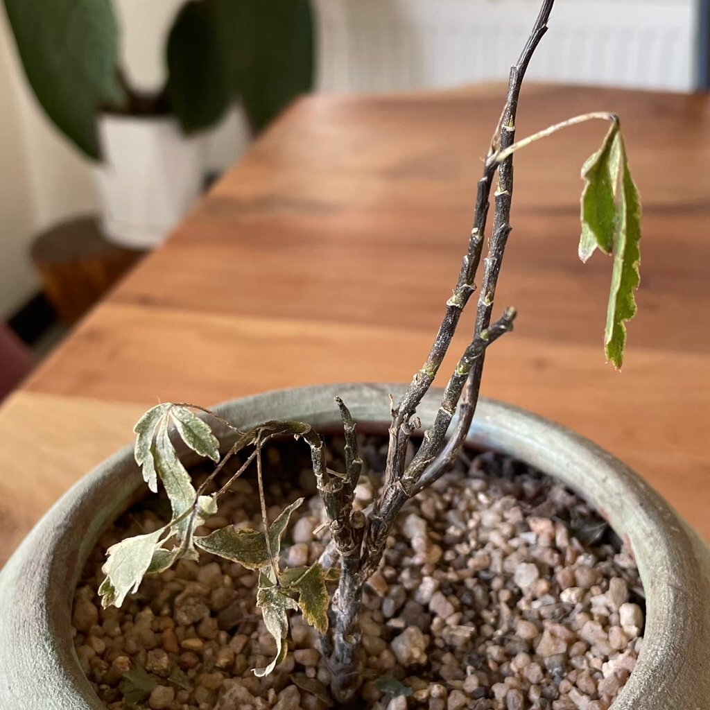
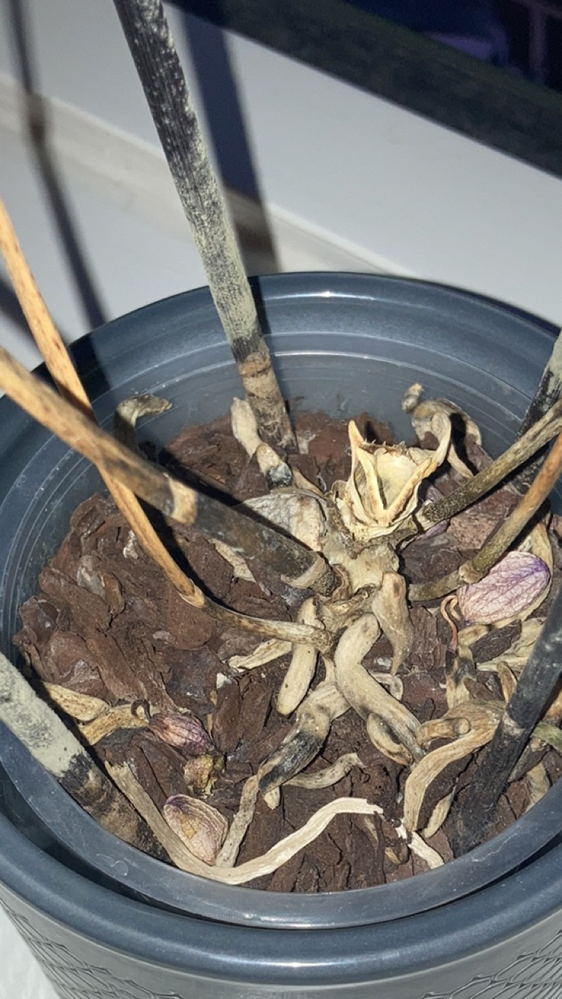
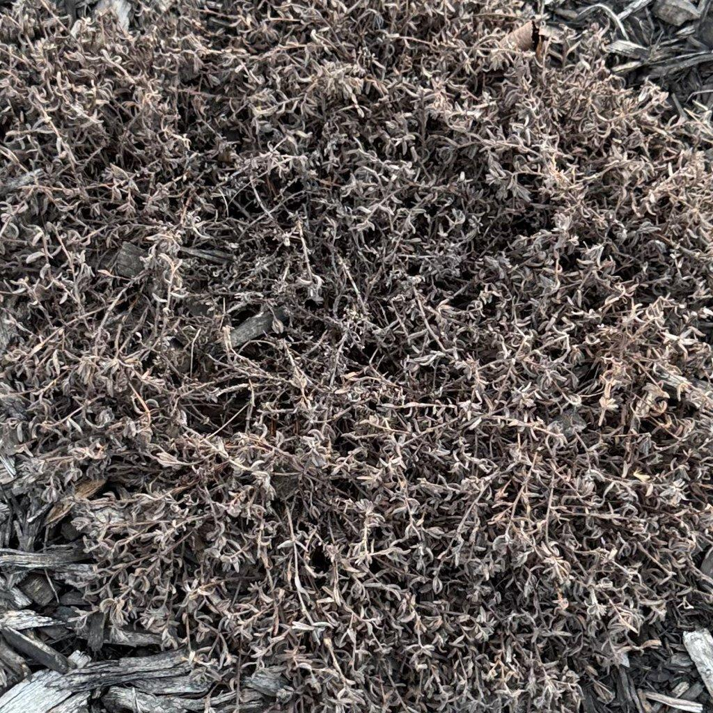

# pianta morta

## Cosa stai osservando
Tessuti marroni o neri, foglie che cadono e si sbriciolano, fusti secchi che si spezzano o, al contrario, molli e collassati; radici scure, vuote o maleodoranti. La pianta non reagisce all’irrigazione e non emette nuovi germogli.

## Descrizione
Indica la perdita della funzionalità dei tessuti vitali (radici, fusti, gemme). È spesso l’esito finale di marciumi radicali, siccità prolungata, gelo/calore estremi o interventi colturali inadatti (rinvasi aggressivi, potature drastiche).

## È un problema reale o un evento naturale?
Problema reale. Il recupero è spesso limitato, ma vale la pena cercare parti ancora vive da propagare.

## Possibili cause
Irrigazioni eccessive con scarso drenaggio; intervalli troppo lunghi senza acqua; gelate o ondate di calore; patogeni del colletto e delle radici; danni meccanici durante rinvasi; trascuratezza prolungata.

## Come confermare
Raschia leggermente la corteccia: verde = vivo, marrone/grigio = morto. Estrai la zolla: radici sane chiare ed elastiche, radici morte scure e che si spezzano. Piega un rametto sottile: se si spezza secco è morto; se flette e all’interno è verde, è vivo.

## Cosa fare
1) Se individui porzioni vive, preleva talee sane o dividi rizomi/cespi.  
2) Elimina e smaltisci materiale marcio o secco.  
3) Disinfetta vaso e attrezzi (es. alcol 70%).  
4) Riparti con substrato fresco e drenante, vaso con fori e irrigazioni adeguate alla specie.  
5) Aumenta luce diffusa, stabilizza temperatura, riprendi nutrizione solo dopo segni di crescita.

## Prevenzione
Controlli settimanali, irrigazione in base all’asciugatura del substrato, rinvasi graduali, acclimatazione quando sposti la pianta tra ambienti molto diversi.

## Immagini

