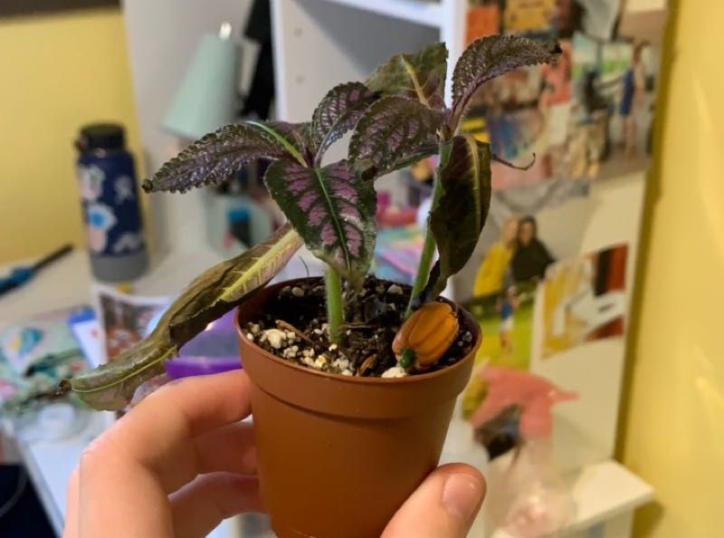

# 干燥的空气

## 你看到的現象
葉尖/葉緣乾枯發褐、捲曲；花苞易掉；介質未全乾但葉仍顯無力。冬季或長時間開啟冷暖氣、除濕機時特別明顯。

## 是什麼
空氣濕度偏低造成的環境壓力。水分蒸散過快，使葉片難以維持張力與組織完整。

## 是否屬於健康問題
屬輕中度、可逆的環境問題；改善濕度與風向後，多能恢復。

## 可能原因
- 室內相對濕度長期低於 40%。  
- 冷暖氣出風或電器熱風長時間直吹葉面。  
- 介質乾得過快（小盆、強風、強光）。

## 如何確認
- 使用濕度計量測（建議 45–60%）。  
- 問題是否在空調強風或冬季更明顯。  
- 介質仍稍濕但葉片已失張力。

## 建議步驟
1) 移位：遠離出風口、暖爐、除濕機；讓風從植株「旁邊」掠過而非直吹。  
2) 增濕：使用裝水托盤＋石子（不讓盆底泡水）、群植、或在通風良好處短暫細霧噴灑（早晨、可 1–2 小時內乾）。  
3) 調整澆水：蒸散高峰期適度縮短乾透間隔，但仍以「澆透—瀝乾」為原則。  
4) 修剪：輕剪乾枯葉尖至健康組織，避免持續消耗。

## 預防小撇步
冬季於日間較暖時段短暫通風；避免長時間直吹；定期擦葉去塵，提升葉面效率。

## 圖片

