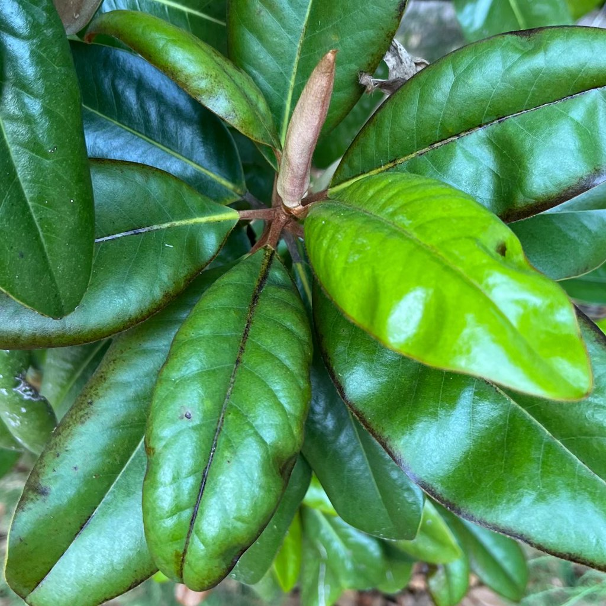

# 新生叶

## 你看到的现象
新叶蜷卷、颜色偏浅或半透明，边缘尚未展开；叶面可能带有淡红/浅黄嫩色，几天后逐渐拉平。

## 是什么
新叶正在生长与展开的自然阶段。细胞壁尚未完全增厚，因此更柔软、更浅色。

## 是否属于正常现象
是自然现象，无需担心。只要核心生长点健康，新叶很快会舒展并转绿。

## 可能原因
- 正常生长；  
- 环境突变（温差、光照变化）会让新叶展开稍慢，但不影响健康。

## 如何确认
- 观察生长心：顶端有新芽不断顶出；  
- 新叶没有病斑或糜烂气味；  
- 1–2周内叶片逐步转深、变硬。

## 你可以做什么
1. **耐心与稳定**：提供明亮散射光，避免暴晒；保持22–28°C稳定温度。  
2. **适度水分**：维持基质微湿但不积水；新叶期不大水大肥。  
3. **不要强行掰开**：强行辅助展开易扯裂或伤及生长点。  
4. **轻度营养**：若已适应环境，可两周一次稀薄平衡肥。

## 预防要点
避免频繁搬动与忽冷忽热；新叶期更注重温柔管理。看到新生，就是最好的健康信号。

## 图片

