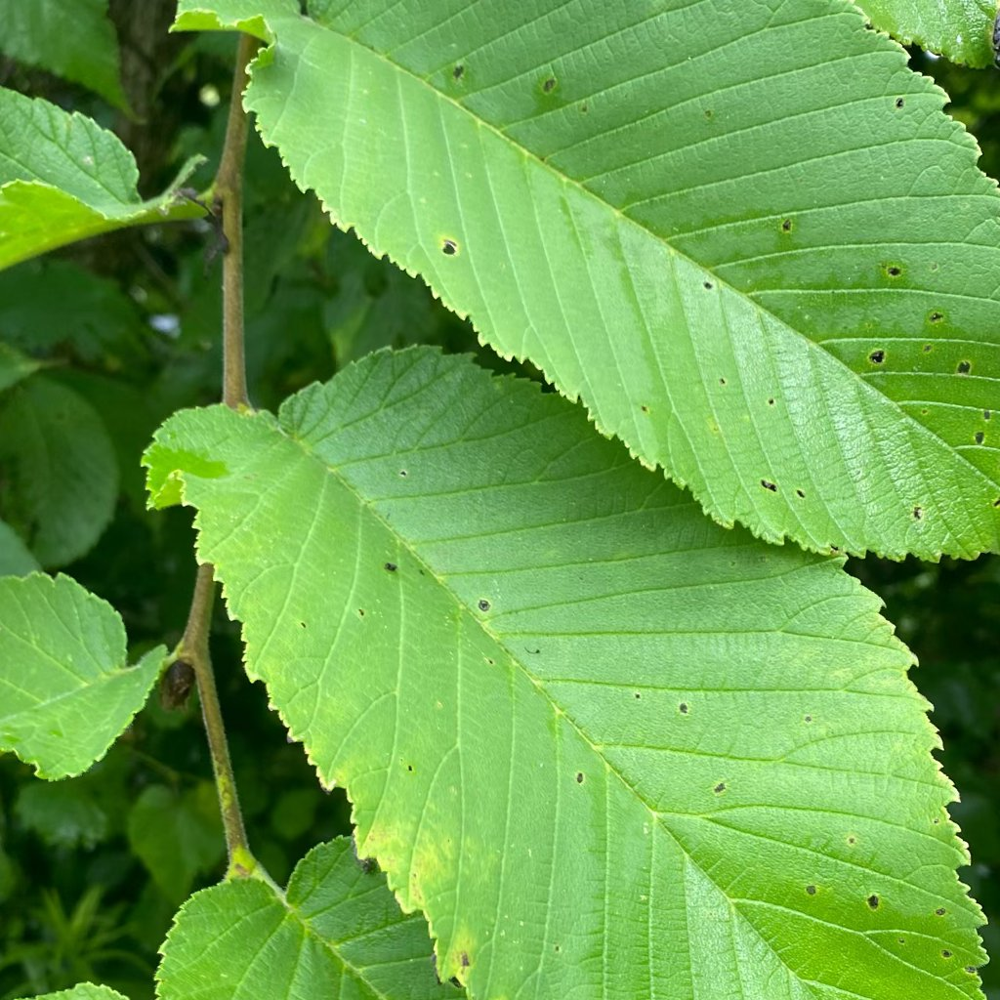

# कीड़ों द्वारा भोजन करने से क्षति

**आप क्या देख रहे हैं:** पत्तियों में अनियमित छेद/कुतरे किनारे, कलियाँ कटी हुई, पत्तियों/मिट्टी पर छोटे काले कण (मल) या कीड़े दिखना।  
**यह क्या है (विवरण):** पत्ती-चबाने वाले कीट (इल्ली, घोंघा/गोगला, बीटल लार्वा) की भोजन-क्षति।  
**समस्या या प्राकृतिक?** हल्का नुकसान सामान्य; लगातार/तेज़ नुकसान पर नियंत्रण ज़रूरी।  

## कैसे पक्का करें:
- रात में टॉर्च से पत्तियों की निचली सतह देखें।  
- चिपचिपे कार्ड पर फँसे कीट पहचानें।  
- छेद + काले दाने = इल्ली/बीटल की उपस्थिति का संकेत।  

## क्या करें (स्टेप-बाय-स्टेप):
1) हाथ से चुनकर हटाएँ—सुबह/शाम आसान।  
2) बाधाएँ/ट्रैप: घोंघों हेतु ताँबे की पट्टी/बियर-ट्रैप।  
3) साबुन घोल/नीम-आधारित स्प्रे (लेबल अनुसार); पत्ती की नीचे वाली सतह तक पहुँचाएँ।  
4) भारी स्थिति में स्पिनोसैड जैसे लक्षित जैव विकल्प (खाद्य पौधों पर निर्देश पढ़ें)।  
5) पौधे की ताकत बढ़ाएँ—संतुलित खाद, उचित रोशनी; रिकवरी तेज़ होती है।  
6) पुनरावृत्ति से बचें: दरारें/कचरा साफ़ करें; नए पौधे/मिट्टी को 2–3 हफ्ते अलग रखें।

**कब मदद लें:** पहचान मुश्किल हो या संवेदनशील पालतू/खाद्य फसलें हों।

## छवियां

