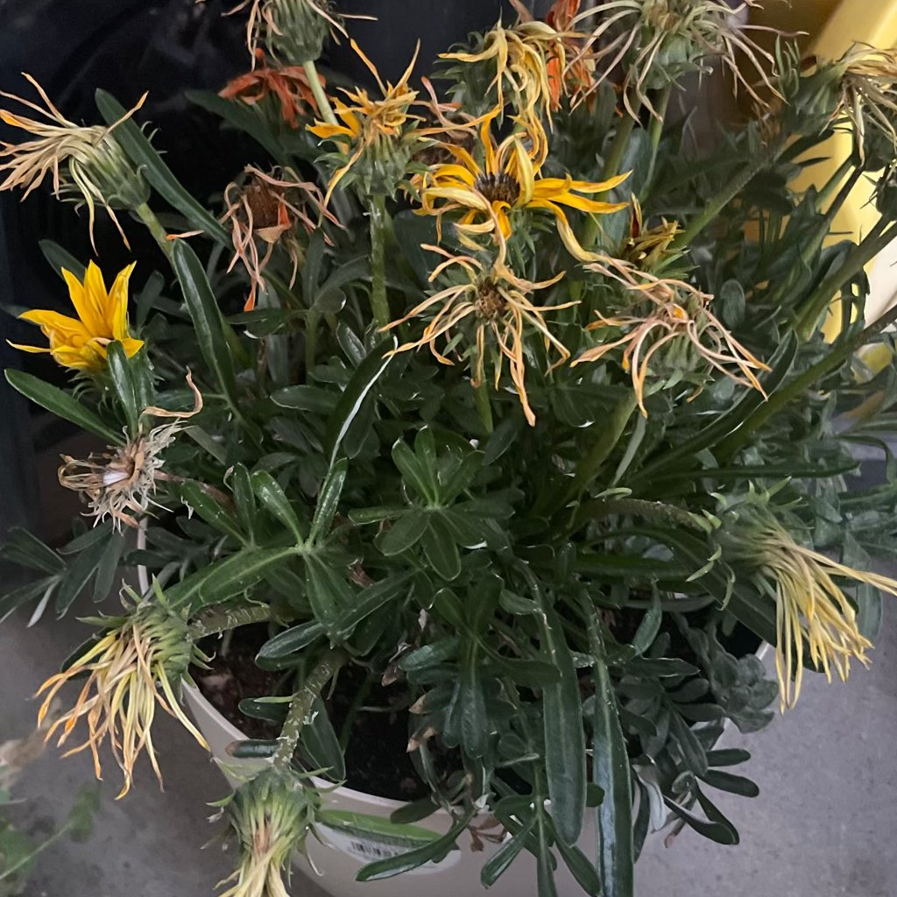

# slutet av blomningstiden.

## Det du ser
Blommor vissnar och faller, kronblad blir bruna efter en period med rik blomning. Växten börjar ofta skjuta blad och stjälkar i stället.

## Beskrivning
Blomning är cyklisk. Efter blomningen går växten över i vilande eller vegetativ fas. Energin riktas från blommor till blad och rötter för att bygga upp reserver inför nästa blomperiod.

## Är det ett problem eller naturligt?
Helt naturligt. Ingen sjukdom eller skada.

## Vanliga orsaker (normala)
- Säsongsskifte och ändrat ljus.  
- Artens genetiska rytm.  
- Pollinerade blommor som sätter frö.

## Så bekräftar du
- Nya skott och friska blad trots att knopparna är borta.  
- Inga tecken på fläcksjukdom, röta eller skadedjur på blad/stjälk.

## Gör så här nu
1) Putsa bort vissna blommor och blomrester för att stimulera ny blomning på sikt.  
2) Ge bra ljus 8–12 h/dag; komplettera med växtlampa vintertid.  
3) Byt till balanserad tillväxtnäring varannan–var tredje vattning.  
4) Håll jorden lätt fuktig – inte blöt.  
5) Vissa arter (t.ex. lökväxter) vill ha svalare, torrare vila.

## Förebygg nästa blomning
- Rätt ljusmängd och dagslängd.  
- Temperaturintervall som arten föredrar.  
- Svag, regelbunden gödsling under uppbyggnadsfasen.  
- Rätt krukstorlek: för stor kruka kan ge blad i stället för blommor.

## När det räcker
Ser växten frisk ut och har bara blommat färdigt behövs inga åtgärder. Ha tålamod – nästa blomcykel kommer.

## Bilder

