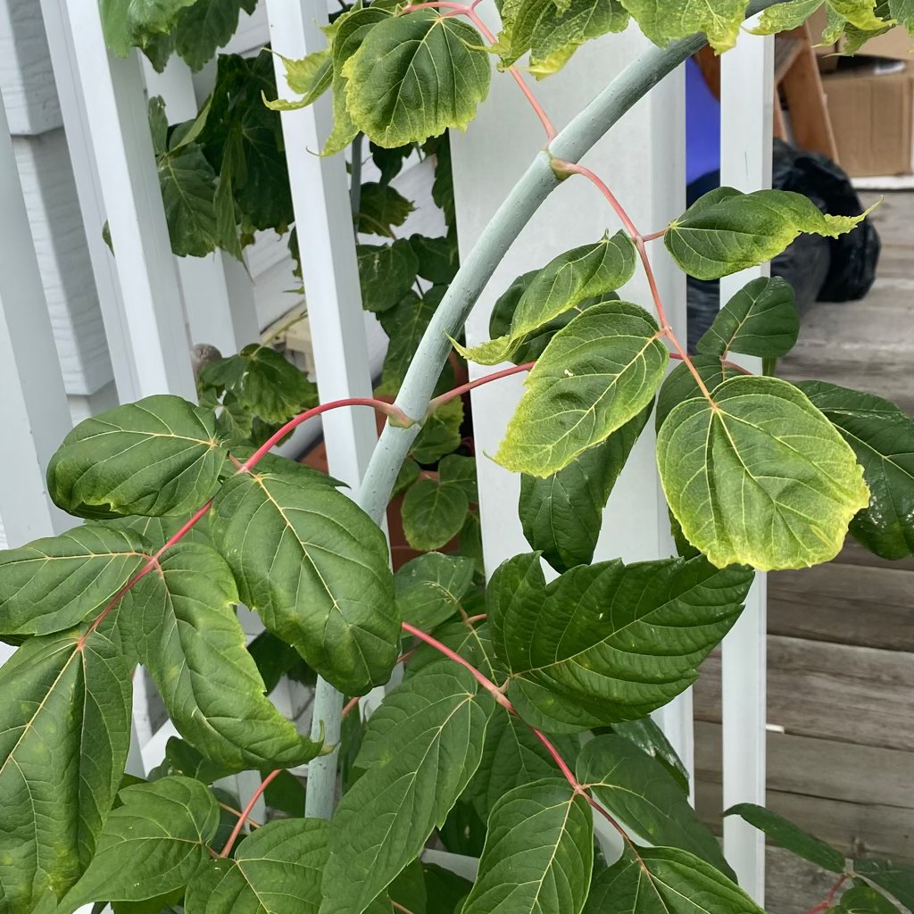

# الضرر بمبيدات الأعشاب

## ما الذي تلاحظه؟
اصفرار/تشوّه أوراق على جانب واحد من النبات أو المجموعة بعد أيام من تعرض قريب لمبيد أعشاب (رش/انجراف).

## ما هو؟ وهل هي مشكلة فعلية؟
أذية **مبيد أعشاب** نتيجة انجراف/بخار/ملامسة. قد تزول مع الوقت أو تترك تشوّهات على النمو الجديد.

## أسباب محتملة
- رش حديقة قريبة في يوم حار/عاصف.  
- استخدام مبيد أعشاب داخل الأصص.  
- تلوث أداة أو تربة بمخلّفات مبيد.

## كيف تتأكد؟
- نمط الضرر يتوافق مع اتجاه الريح/المصدر.  
- الأنواع الحسّاسة تتضرر أكثر من غيرها.

## ماذا تفعل الآن؟
- حسّن التهوية واغسل الأوراق إن كان التعرض حديثًا.  
- لا تُفرط بالقص؛ انتظر نموًا جديدًا لتقييم التعافي.  
- أعد الزراعة إن اشتبهت بتربة ملوّثة أو استبدل الطبقة السطحية.

## الوقاية
- تجنّب استعمال مبيدات الأعشاب قرب نباتات الزينة وداخل المنازل.  
- في الخارج: رش صباحًا بلا ريح وعلى حرارة معتدلة وبمصدّات رذاذ.

## الصور

