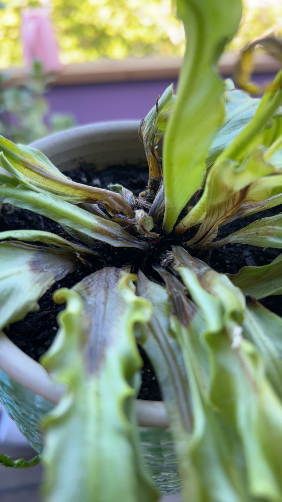

# olämplig vattning i bladrosetten

## Det du ser
Vatten samlas i hjärtat på rosettväxter (t.ex. saintpaulia, bromelia). Därefter mörka fläckar och röta i centrum.

## Beskrivning
Stående vatten i rosetten kan orsaka röta, särskilt i kyla eller svagt ljus med låg ventilation. Skadan börjar i mitten och sprider sig därifrån.

## Är det ett problem eller naturligt?
Odlingsproblem som kan bli allvarligt om det fortsätter.

## Vanliga orsaker
- Vattning uppifrån rakt i rosetten.  
- Kallt vatten i sval miljö.  
- Tät, fuktig luft utan cirkulation.

## Så bekräftar du
- Mjuk, mörk vävnad i rosetthjärtat.  
- Sumpig lukt.  
- Skadan sitter i centrum snarare än i bladspetsar.

## Gör så här nu
1) Tippa ut allt stående vatten.  
2) Ta bort skadat, mjukt material med steril sax.  
3) Låt torka upp i varm, ljus miljö med god luftning.  
4) Vattna endast i jorden – gärna underifrån via ytterkruka; häll bort överskott efter 15–20 min.  
5) Vid svår skada, ta friska bladsticklingar och rota separat.

## Förebygg framöver
- Undvik vatten i rosetten, särskilt kvällstid och vinter.  
- Håll jämn värme och undvik kallt drag.

## När det räcker
Tidigt upptäckt räcker ofta torkning och ändrad vattning för att stoppa skadan.

## Bilder

