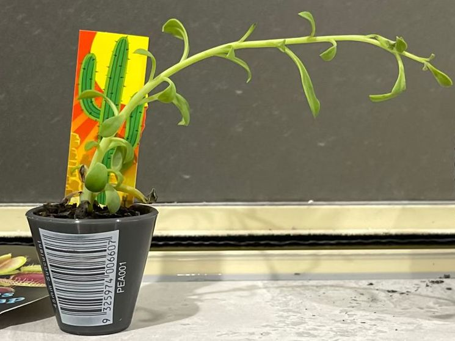

# Lichtmangel

## Was Sie beobachten
Langtriebigkeit (lange Internodien), nach vorn geneigte Pflanzen, kleine blasse Blätter, ausbleibende Blüte.

## Was es ist
Bei zu wenig Licht produziert die Pflanze weniger Energie. Sie „streckt“ sich zur Lichtquelle und schwächt Blätter/Triebe.

## Einordnung
Reales, häufiges Standortproblem; gut korrigierbar.

## Häufige Ursachen
Dunkle Ecken, großer Abstand zum Fenster, Nordlage, Winterkurztage.

## So bestätigen Sie die Diagnose
- **Schatten-Test:** Hand wirft kaum definierte Schatten → zu dunkel.  
- Wuchsrichtung klar **zum Fenster**; Innenbereiche verkahlen.

## Maßnahmen
- **Heller stellen:** näher ans Fenster (Süd/West mit Vorhang), ggf. **Pflanzenlampe** 10–12 h/Tag.  
- Beim Umstellen über 1–2 Wochen **eingewöhnen**.  
- Rückschnitt/Formierung für kompakteren Neuaustrieb.

## Vorbeugen
Standort saisonal neu bewerten, Lampen mit Zeitschaltuhr nutzen, helle Wände/Reflektoren helfen.

## Bilder

