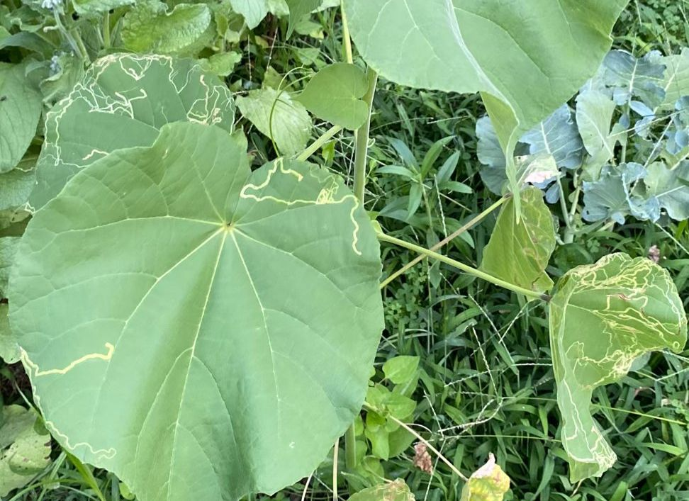

# insectes mineurs

## Ce que vous observez
Galeries sinueuses, claires, à l’intérieur des feuilles ; parfois petites larves visibles en fin de galerie. Les feuilles jaunissent ou se déforment.

## De quoi s’agit-il ?
Mineuses des feuilles : de minuscules larves creusent entre les deux épidermes, laissant des traces serpentiformes.

## Gravité — normal ou problème ?
Généralement modérée sur plantes d’intérieur, mais peut devenir inesthétique et affaiblir des jeunes plants.

## Causes possibles
- Adultes ayant pondu sur la feuille (plantes de balcon/jardin, plantes récemment sorties).  
- Portes/fenêtres ouvertes en saison.

## Comment confirmer
- Galeries très **caractéristiques**, parfois un petit point sombre (excréments) dans la mine.  
- Larve visible par transparence en bout de galerie.

## Que faire (étapes)
1. **Supprimer** les feuilles les plus atteintes et les jeter.  
2. **Écraser** délicatement la larve dans la galerie si repérée.  
3. **Renforcer** la plante (lumière, arrosage régulier) pour favoriser le renouvellement foliaire.  
4. **Au balcon/jardin** : filets fins, **pièges englués** jaunes pour surveiller, interventions ciblées si fortes attaques (suivre étiquettes).

## Prévention pour la suite
- Quarantaine des plantes qui sortent/rentrent.  
- Nettoyage et surveillance réguliers.  
- Éviter les traitements foliaires inutiles qui éliminent les auxiliaires au jardin.

## Images

