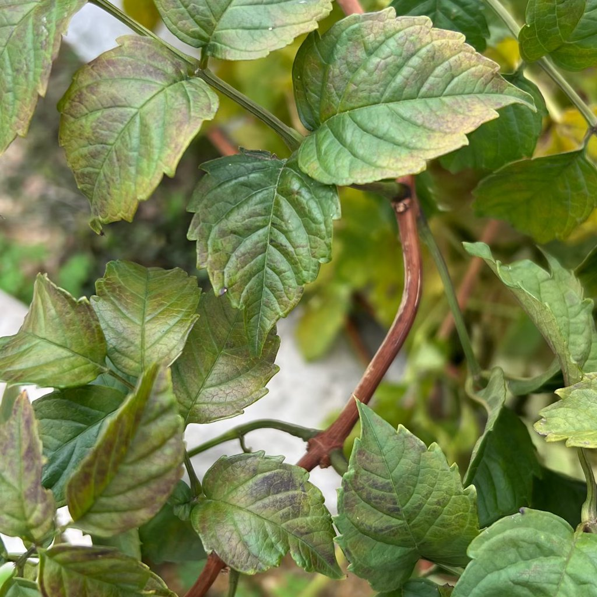

# overtollig licht

## Wat je ziet
Bleekverkleuring, crispy plekken, ingebrande vlekken of “schaduw” van raamstijlen op blad. Variegate delen verbranden sneller.  

## Wat is het?
Lichtoverschot (en vaak **hitte**) boven wat de soort gewend is. Weefsels raken beschadigd, chlorofyl breekt af.  

## Is dit een probleem of natuurlijk?
Probleem, maar lokaal. Nieuwe bladeren kunnen normaal zijn als je de plek aanpast.  

## Mogelijke oorzaken
- Midden­dagzon op zuid-/westraam.  
- Te dicht onder groeilamp.  
- Snel van donker naar fel licht verplaatst (geen gewenning).  

## Zo controleer je het
Voel aan het blad en glas midden op de dag: heet? Bekijk vooral de zonzijde; schades zijn vaak scherp begrensd.  

## Wat je nu kunt doen
1) **Filter**: gebruik lichte vitrage of verplaats 0,5–1,5 m van het raam.  
2) **Acclimatiseren**: verhoog licht in stappen over 2–3 weken.  
3) **Lampafstand**: 30–45 cm boven blad, 12–14 u/dag; verhoog afstand als blad warm aanvoelt.  
4) **Snoei**: laat zwaar verbrande delen zitten tot er nieuw blad is; dan wegknippen.  

## Voorkomen
- In lente/zomer zonbaan volgen en tijdig filteren.  
- Water ’s ochtends; hete, volle zon + waterfilm vergroot bladstress.

## Afbeeldingen

