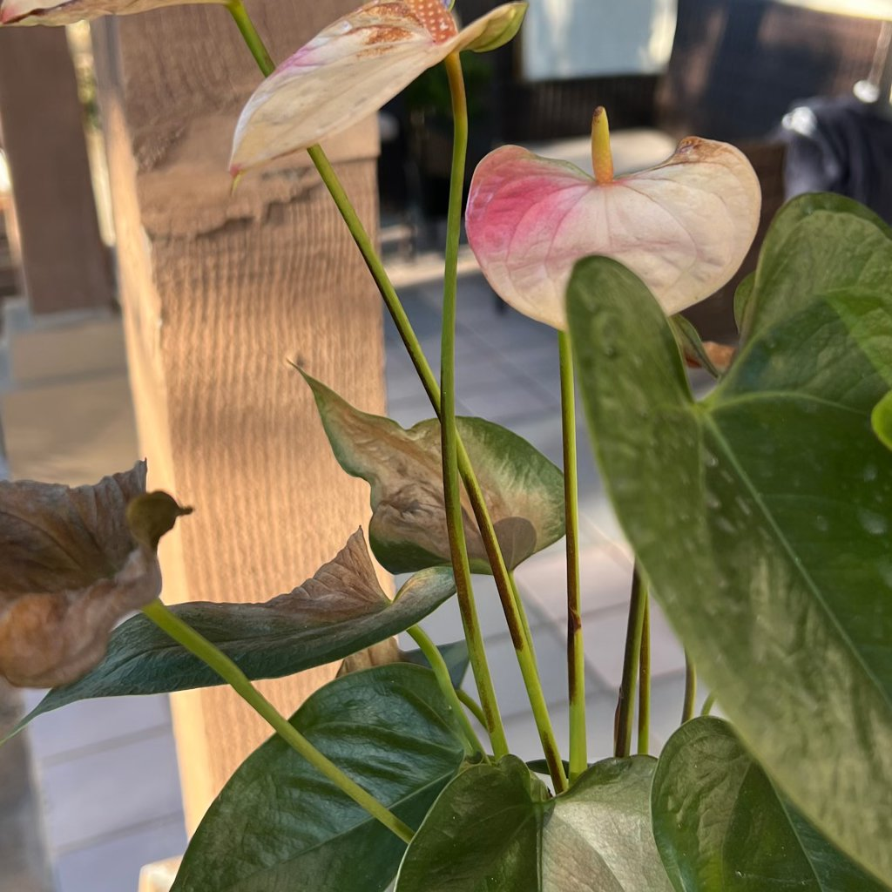

# light or heat source damage

## What you’re seeing
Localized scorch, dry patches, or faded leaves closest to a lamp, radiator, fireplace, or other heat source. Soil may dry unevenly on the heated side.

## What it is
Damage from proximity to an artificial light or heat device—intensity, or hot air flow exceeding what the foliage can handle.

## Is action needed?
Yes—reposition and manage intensity.

## How to confirm
- **Distance test:** Injury is worst on the side nearest the device; moving the plant **15–60 cm (6–24 in)** away halts progression.  
- **Device profile:** High-output LEDs without diffusers, halide lamps, or strong heaters are common culprits.

## What to do
1. **Increase distance** from the device; add diffusers/reflectors for lights.  
2. **Reduce photoperiod** to **10–12 hours** under strong fixtures.  
3. **Redirect hot airflow** away from foliage.  
4. **Hydrate appropriately**; warmer zones dry faster.  
5. **Trim only dead tissue** once new growth resumes.

## Prevention tips
- Follow manufacturer’s recommended plant-to-light distance.  
- Use fans for gentle air mixing—not directly blasting plants.  
- Check foliage temperature by touch; if it’s hot to your hand, it’s too hot for leaves.

## Related look-alikes to rule out
- **Sunscald** from window sun shows on the glass-facing side after a bright day.  
- **Light excess** without heat yields paler, not crispy, leaves.

## Images

