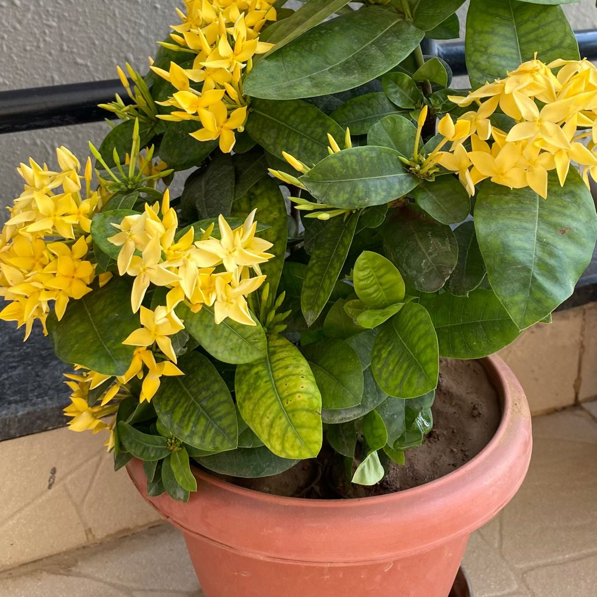

# Nährstoffmangel

## Was Sie beobachten
Gelbverfärbungen (oft zwischen den Adern), kleineres Blattwerk, verlangsamtes Wachstum. Je nach Nährstoff sind alte oder junge Blätter stärker betroffen.

## Was es ist
Anhaltend zu wenig verfügbare Nährstoffe führen zu **Mangelerscheinungen**. Ursachen: seltene Düngung, pH-Verschiebungen, ausgelaugte Erde, zu hartes Wasser (Bindung mancher Nährstoffe).

## Einordnung
Reales Versorgungsproblem; gut steuerbar.

## Häufige Ursachen
Seltenes Düngen, alte Erde, pH-Probleme, Salzansammlungen, einseitige Nährstoffgaben.

## So bestätigen Sie die Diagnose
- Gleichmäßige Muster **ohne** punktförmige Nekrosen (spricht eher gegen Verbrennung/Krankheit).  
- Pflanze stand lange im selben Substrat; Düngung unregelmäßig.

## Maßnahmen
- Mit **halb dosiertem, ausgewogenem Dünger** starten (alle 2–4 Wochen in der Saison).  
- Bei Salzverdacht: Substrat **durchspülen** (≈ 3× Topfvolumen).  
- Langfristig ggf. **umtopfen** in frische, strukturierte Erde; Wasserqualität prüfen (bei sehr hartem Wasser anteilig weiches Wasser).

## Vorbeugen
Düngeplan an Art und Saison anpassen; lieber **regelmäßig niedrig** als selten hoch; unterschiedliche Bedürfnisse (z. B. Starkzehrer vs. Schwachzehrer) berücksichtigen.

## Bilder

