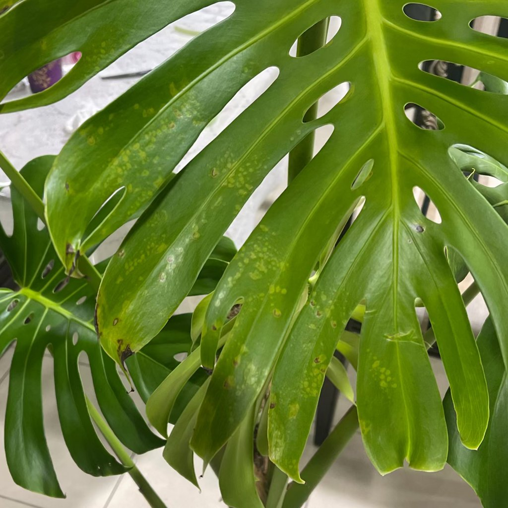

# 農藥損傷

## 你看到的現象
噴藥後 24–72 小時出現葉面斑駁、透明水浸狀或焦邊；非病斑蔓延型，嫩葉受害較重。

## 是什麼
藥害（植體對藥劑敏感，或濃度/混配/時段不當）造成的非感染性傷害。

## 是否屬於健康問題
是，但多可藉停藥與良好養護逐步恢復；既有受害部位不易逆轉，重點在新葉恢復正常。

## 可能原因
- 濃度過高或與其他藥劑/肥料混用。  
- 高溫、強光下噴施；葉面未乾即曝曬。  
- 敏感品種（嫩葉、銀葉、多肉等）。

## 如何確認
- 現象只在噴藥後出現，且鄰近未噴到的葉片正常。  
- 無病斑擴散的邊界特徵。

## 建議步驟
1) 立即以清水噴洗葉片，改善通風並避光 48 小時。  
2) 暫停所有藥劑與葉面肥，等待新葉健康長出。  
3) 之後採小面積「試噴」：先噴 2–3 片葉，觀察 24 小時無異狀再全面施用；嚴守標示濃度與時段（清晨/傍晚）。

## 預防小撇步
不同藥劑避免隨意混配；對敏感植物優先採環境與物理管理。

## 圖片

