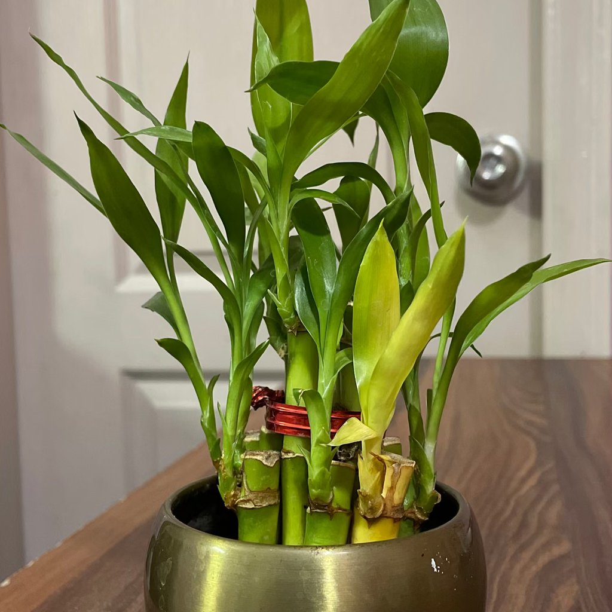

# root damage

## What you’re seeing
Sudden or ongoing wilt despite moist soil, stunted growth, leaf drop, or failure to thrive after repotting or physical disturbance. Roots may look browned, broken, or sparsely branched.

## What it is
Damage to the root system from rot (chronic wetness), physical breakage during repotting/transport, pests (e.g., grubs), extreme fertilizer salts, or compacted/anaerobic media.

## Is action needed?
Yes—roots are the engine; prioritize their recovery.

## How to confirm
- **Unpot gently:** Healthy roots = firm, white/tan with growing tips. Damaged roots = black/brown, mushy, hollow, or crispy.  
- **Smell test:** Sour/rotten odor indicates rot.  
- **History:** Recent repot, overwatering, or fertilizer mishap.

## What to do
1. **Trim to healthy tissue** with sterilized shears.  
2. **Repot in fresh, airy mix** sized appropriately; ensure drainage holes.  
3. **Water once thoroughly,** then let the mix partially dry before watering again.  
4. **Shelter in bright, indirect light;** avoid intense sun while roots rebuild.  
5. **Pause feeding** for 3–4 weeks; then resume a gentle, balanced program.  
6. **Consider a rooting hormone** (optional) at repot to encourage new tips.

## Prevention tips
- Handle root balls carefully; support from beneath when moving.  
- Refresh aging media and avoid chronic sogginess.  
- Dilute fertilizer correctly; flush pots periodically to avoid salt burn.

## Related look-alikes to rule out
- **Water deficiency** looks similar—but if soil is moist and wilt persists, suspect roots.  
- **Cold shock** can also cause wilt after draft exposure.

## Images

