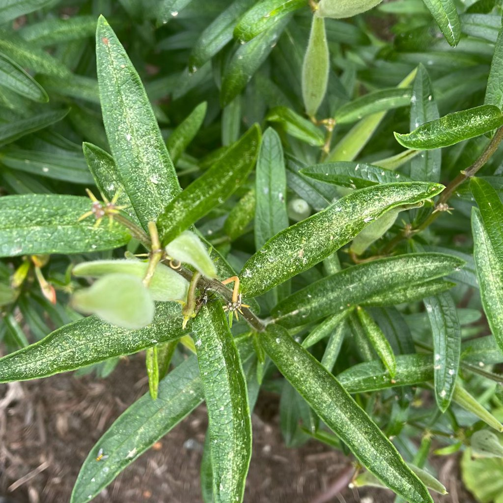

# insetos sugadores

## O que você está vendo
Folhas amareladas/encarquilhadas, pontos cloróticos, **melada pegajosa** e, sobre ela, **fumagina** (camada escura). Colônias pequenas em brotos e no verso das folhas.

## Descrição
Pragas **sugadoras de seiva** (pulgões, cochonilhas, moscas-brancas; ácaros em condições secas). Enfraquecem a planta e podem transmitir vírus; a melada favorece fungos.

## É um problema real?
Sim, mas **tratável** quando identificado cedo.

## Como confirmar
- Examine o **verso** das folhas (lupa ajuda).  
- Toque: presença de **melada**.  
- Sopre levemente: adultos de **mosca-branca** podem sair voando.

## Causas prováveis
Ar seco, excesso de nitrogênio (brotos muito tenros), pouca circulação de ar, novas plantas já contaminadas.

## O que fazer agora
- **Lave** a planta na pia, focando o verso das folhas.  
- Aplique **sabão próprio para plantas** ou **óleos vegetais**, conforme rótulo; **repita semanalmente** por 2–3 semanas.  
- **Isole** a planta até controlar.

## Prevenção
Quarentena de novas plantas por 2 semanas, inspeção semanal, umidade adequada e adubação **equilibrada** para evitar brotações excessivamente tenras.

## Imagens

