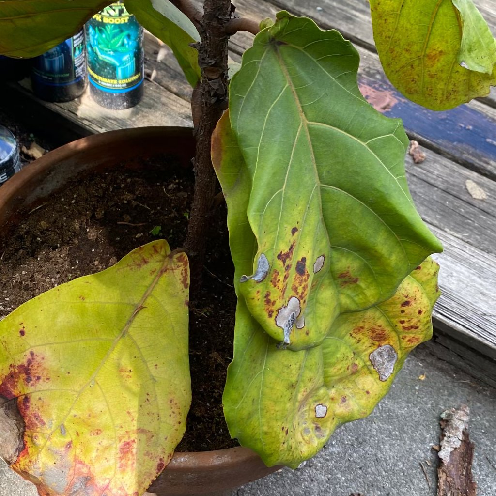

# oparzenia słoneczne

## Co widzisz
Białe, a potem brązowe plamy na powierzchni liści wystawionej do słońca; brzegi mogą wyglądać jak „spalone”.

## Co to jest
Poparzenie słoneczne liści — nadmiar światła i ciepła przekracza tolerancję gatunku.

## Czy to problem?
Tak dla tych liści, ale zwykle nie dla całej rośliny, jeśli zareagujesz.

## Możliwe przyczyny
- Południowe słońce przez szybę latem.  
- Brak aklimatyzacji po przeniesieniu na jaśniejsze stanowisko.

## Jak potwierdzić
Plamy odpowiadają kierunkowi światła; brak śladów szkodników i chorób.

## Co zrobić teraz
- Cieniuj lub przesuń roślinę głębiej w głąb pokoju.  
- Usuń mocno poparzone liście.  
- Nawadniaj zgodnie z potrzebami (bez „lania na zapas”).

## Jak zapobiegać
Stopniowa adaptacja do słońca, firanka latem, rozsądne ustawienie lamp względem liści.

## Zdjęcia

