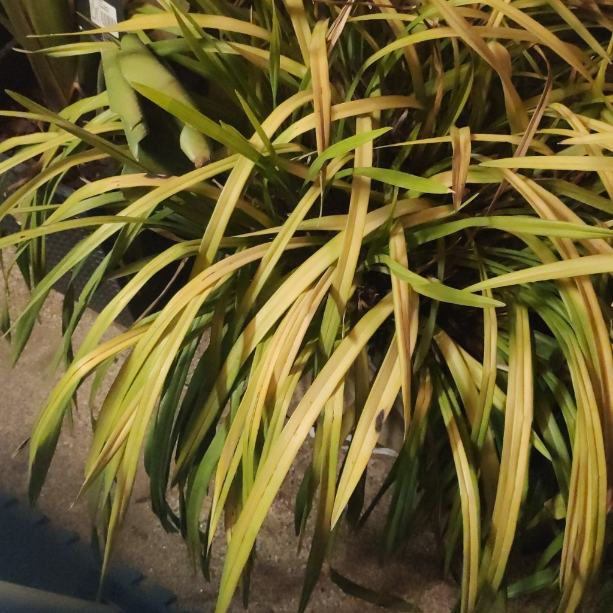

# escaldado solar

## Qué estás viendo
Zonas blanqueadas o pajizas en hojas expuestas repentinamente a sol intenso; en tallos tiernos pueden aparecer grietas o corchos.

## Descripción
Escaldado solar: daño súbito por radiación y calor en tejidos no aclimatados, típico tras mover una planta de sombra a sol fuerte o durante una ola de calor.

## ¿Es un problema real o algo natural?
Es un problema ambiental agudo. Las zonas quemadas no se recuperan, pero el resto de la planta puede hacerlo.

## Cómo confirmarlo
- Ocurre tras cambio de ubicación o un día de calor extremo.  
- Afecta más a la cara orientada al sol y a hojas jóvenes.  
- No hay signos de plaga; el patrón son parches claros y secos.

## Qué hacer
1) Mueve a luz brillante indirecta y filtra el sol directo.  
2) Aclimata gradualmente si buscas más luz (incrementos semanales).  
3) Mantén riego regular sin encharcar y evita podas severas inmediatas; retira solo lo totalmente necrosado.  
4) Ventila para disipar calor en ventanas.

## Prevención
- Aclimatación por etapas al pasar de sombra a sol.  
- Visillos o láminas UV en cristales muy expuestos.

## Cuándo pedir ayuda
Si el daño continúa pese a ajustar luz/temperatura, revisa exceso de fertilizante o calor de lámparas y consulta.

## Imágenes

