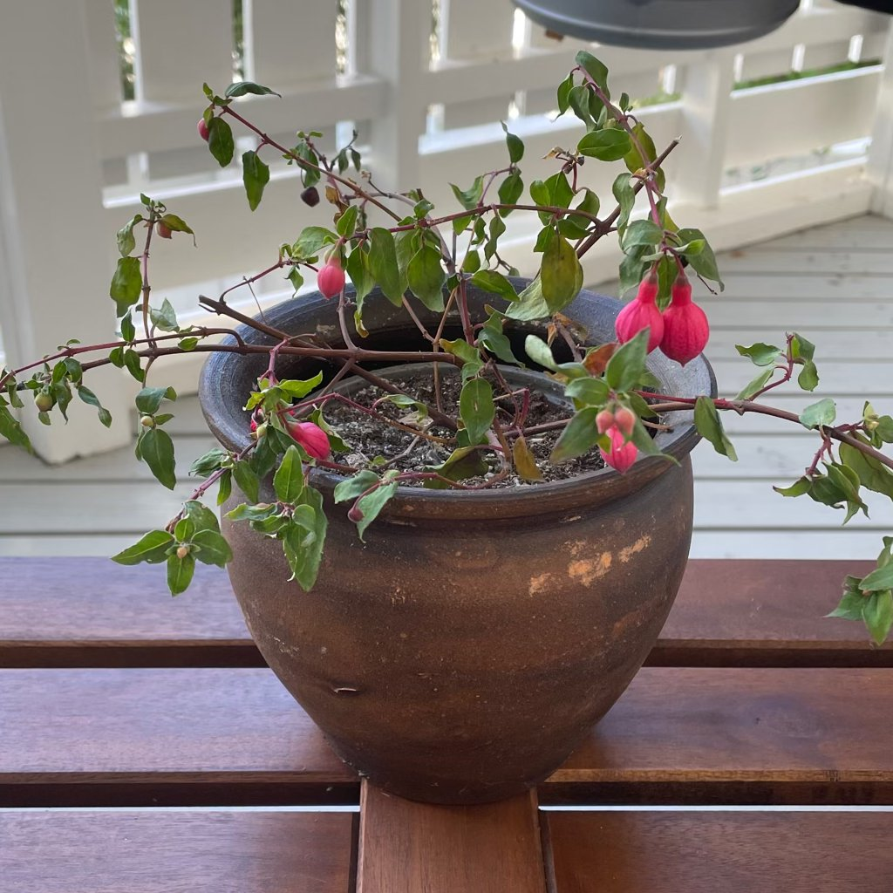
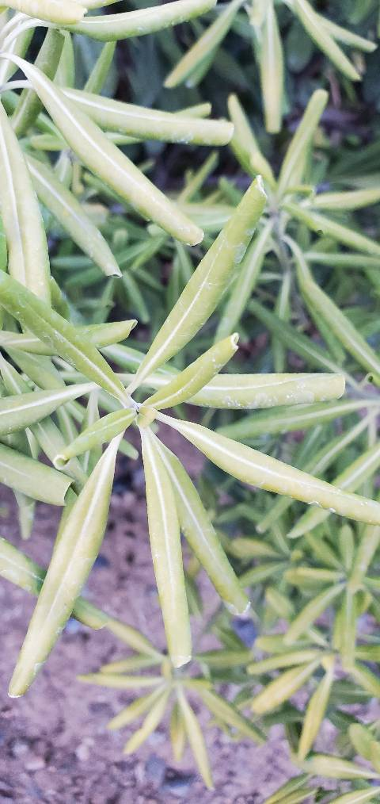
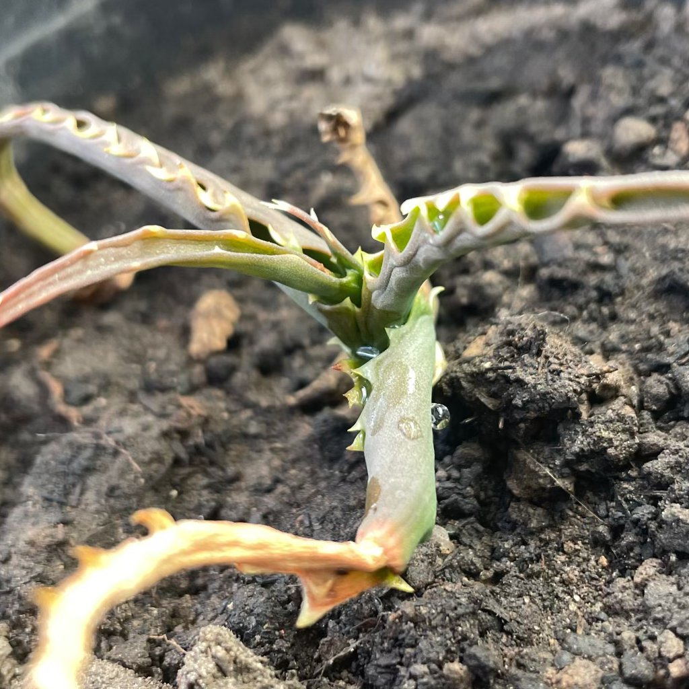
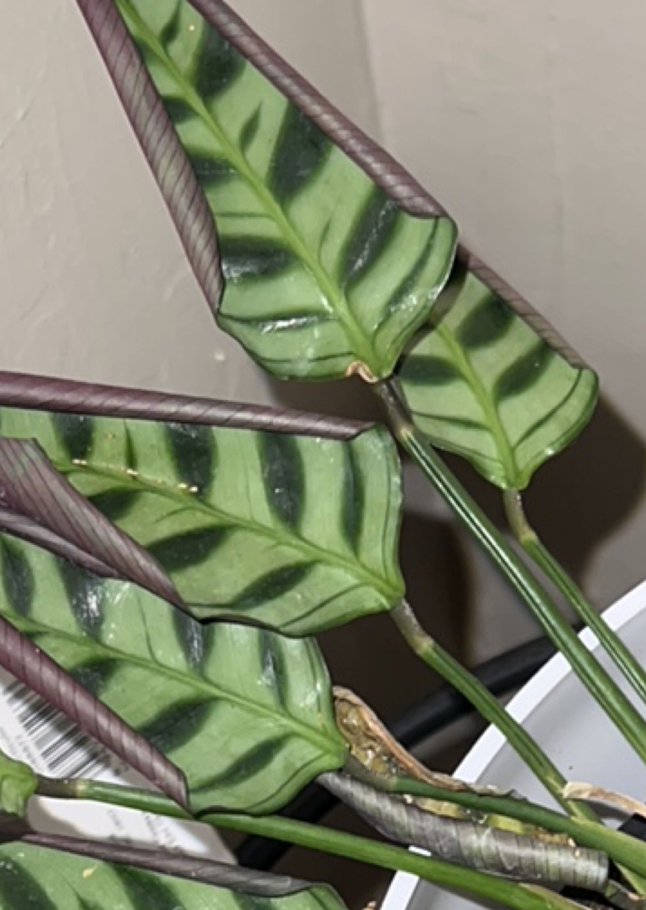
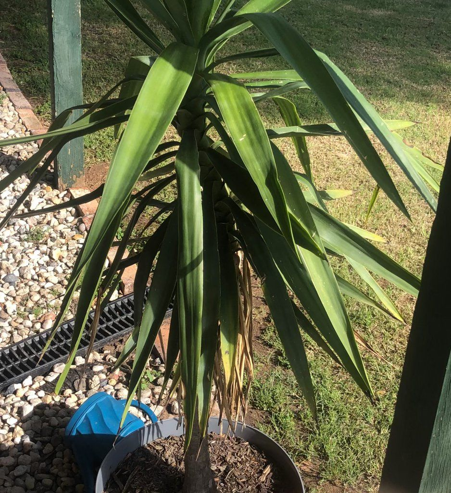

# onvoldoend begieten

## Wat je ziet
Slaphangende bladeren, doffe kleur, droge randen; potgrond voelt licht en stofdroog, pot weegt weinig. Soms laat de plant bladeren vallen.  

## Wat is het?
Watertekort: de wortels krijgen te weinig vocht om het blad te ondersteunen.  

## Is dit een probleem of natuurlijk?
Probleem, maar snel te verhelpen. Kortdurende droogte veroorzaakt meestal alleen cosmetische schade.  

## Mogelijke oorzaken
- Te weinig of te lange intervallen tussen gietbeurten.  
- Substraat dat water afstoot (uitgedroogde veen/kluit).  
- Warmte/zon en kleine pot.  

## Zo controleer je het
Vinger 2–3 cm diep: gortdroog. Pot tilt heel licht. Aarde kan los van de potwand zijn gekrompen.  

## Wat je nu kunt doen
1) **Rehydrateren**: geef langzaam lauw water tot het onder uit de pot loopt; herhaal na 5–10 min. Of dompel pot 10–15 min in een bak water, laat volledig uitlekken.  
2) **Substraat reset**: prik met stokje gaatjes voor betere doorwatering; meng bij volgende verpotting 10–20% perliet.  
3) **Bladzorg**: knip volledig verdorde delen weg.  
4) **Schema**: weeg de pot na het watergeven en weer als hij licht is; dit leert je interval.  

## Voorkomen
- Gebruik een doorlatende mix passend bij de soort.  
- In warme maanden kortere intervallen of grotere pot met meer buffer.  
- Mulchlaagje (schors, kokos) remt verdamping.

## Afbeeldingen

