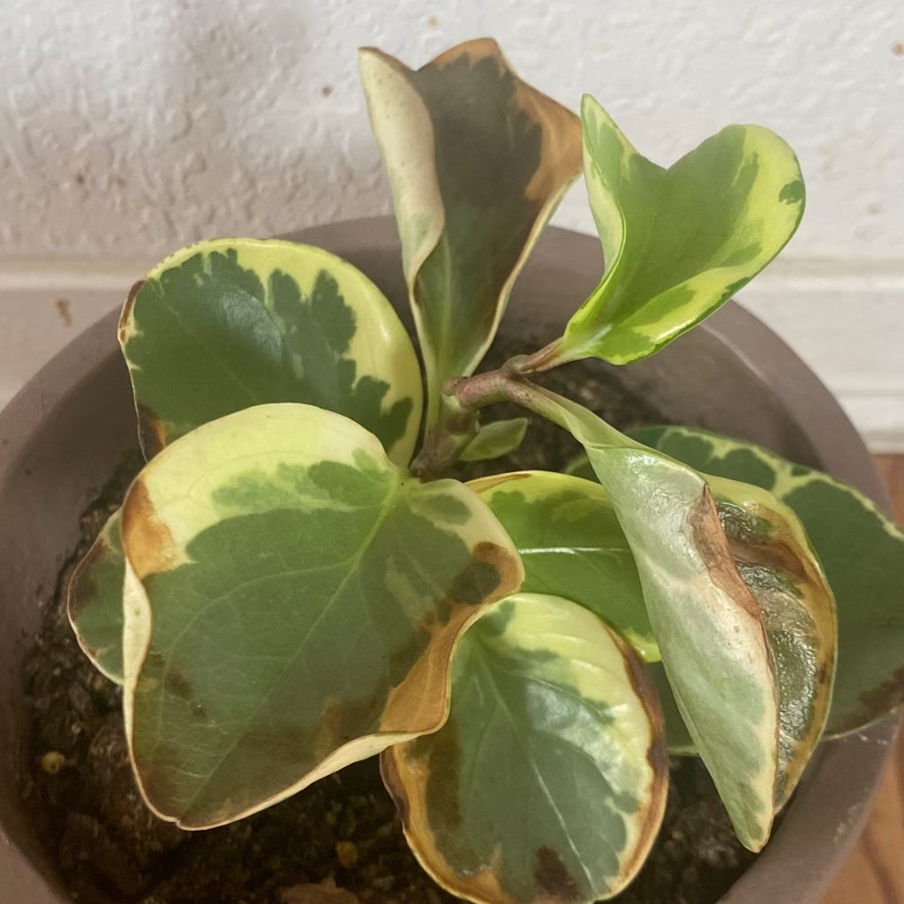
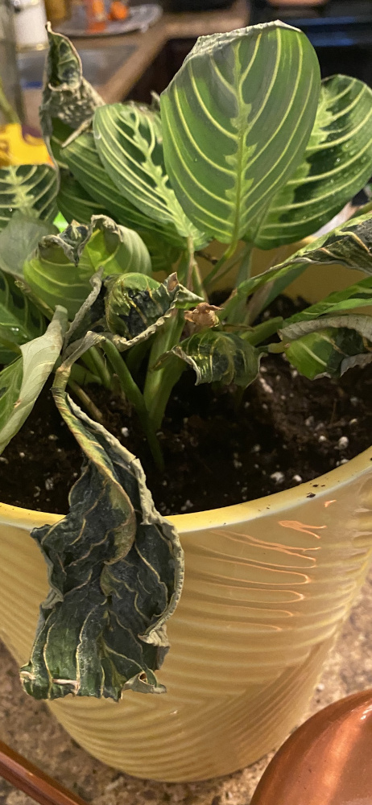
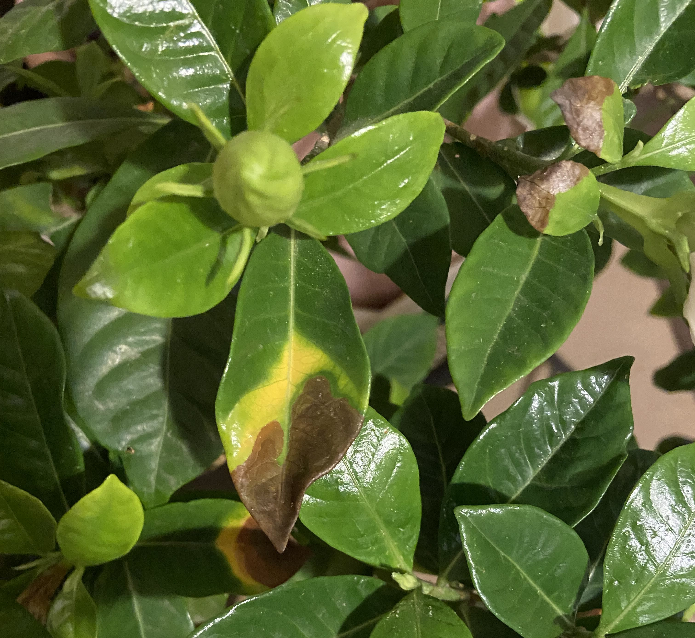
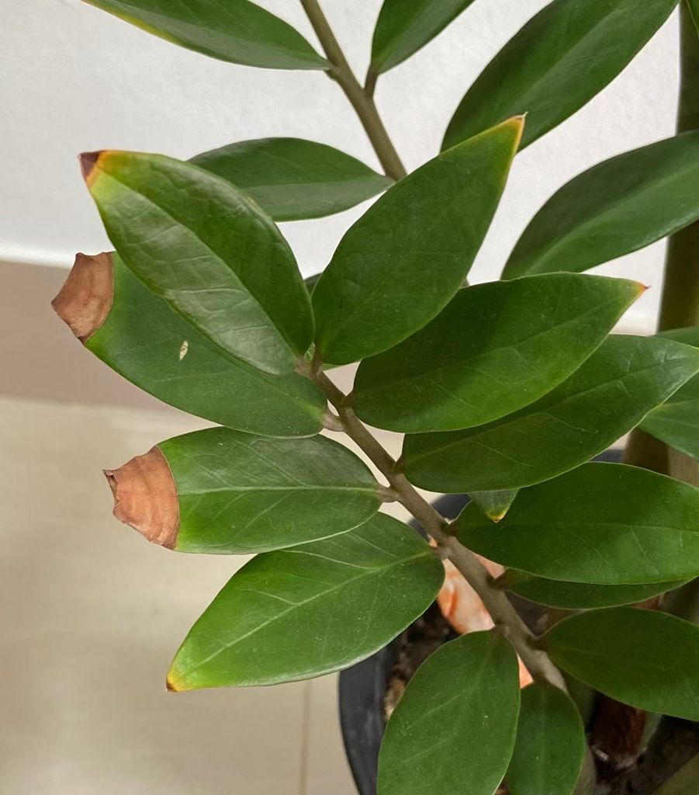

# water excess or uneven watering

## What you’re seeing
Droopy, yellowing lower leaves, soggy soil, fungus gnat activity, or edema blisters. Pot feels heavy for days; growth slows. Intermittent cycles of very wet then very dry also show up as leaf drop or brown tips.

## What it is
Roots are stressed by too much water or inconsistent extremes. Low oxygen in a persistently wet mix damages roots; then even normal watering can’t be absorbed well.

## Is action needed?
Yes. Protect roots, restore drainage, and adopt a steady rhythm.

## How to confirm
- **Finger/meter:** The mix stays wet at depth for **> 5–7 days** (for most indoor mixes) in moderate conditions.  
- **Roots:** Brown, mushy, or foul-smelling roots = damage.  
- **Pot/mix:** No drainage holes, compacted/peaty mix, or an oversized pot relative to the plant.

## What to do
1. **Hold watering** until the top **1–2 in / 2–5 cm** dries (species-dependent).  
2. **Improve drainage:** Ensure drainage holes; consider repotting into a **chunkier mix** and an appropriate pot size.  
3. **Trim rot:** With sterile tools, remove mushy roots and repot in fresh mix; water once, drain, then let partially dry before next watering.  
4. **Airflow & light:** Brighten light (indirect) and provide gentle airflow to help the mix dry evenly.  
5. **Consistency:** Water smaller amounts more regularly rather than flooding and drought cycling.  
6. **Gnat control:** Allow surface to dry, use yellow sticky traps, and consider a **biological control** (Bti) for larvae if needed.

## Prevention tips
- Right-size pots and avoid “potting up” too far. If the pot is too large for the root mass, it dries very slowly—downsize at next repot.  
- Refresh old, collapsed media yearly.  
- In cool/dim seasons, reduce frequency rather than quantity—roots drink less.

## Related look-alikes to rule out
- **Nutrient deficiency** can yellow leaves too—check root health first; damaged roots can’t uptake nutrients properly.  
- **Lack of light** slows use of water—improve light along with watering changes.

## Images

