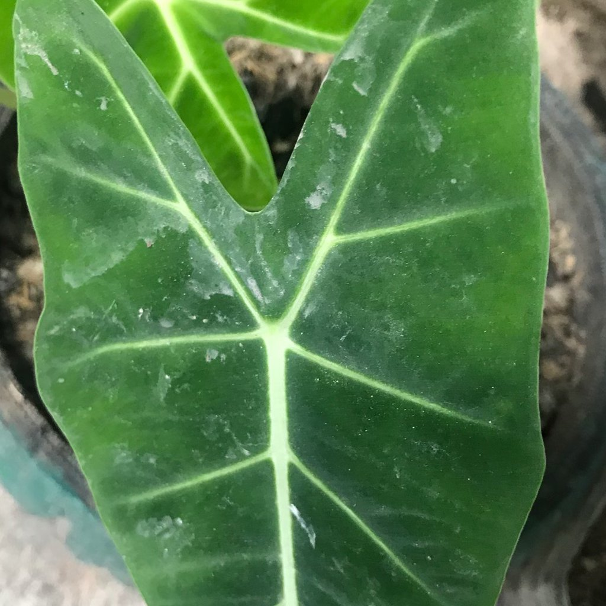
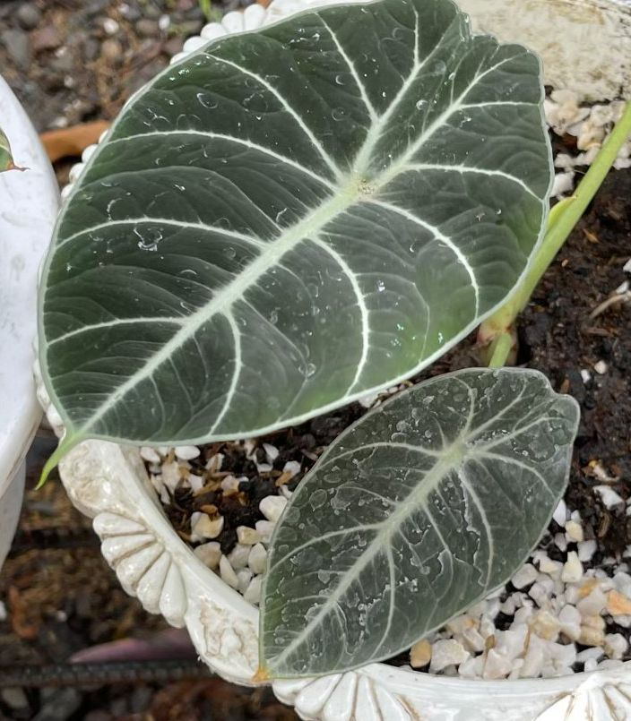

# بقايا رذاذ الماء

## ما الذي تلاحظه؟
بقع باهتة/بيضاء أو دوائر متخشنة على الأوراق بعد رش الماء أو المحاليل؛ لا تتمدّد البقع ولا يصاحبها موت نسيجي عميق.

## ما هو؟ وهل هي مشكلة فعلية؟
بقايا أملاح من ماء عسِر أو آثار رذاذ سماد/مبيد بعد جفافه. غالبًا **غير ضارة** وتجميليّة فقط.

## أسباب محتملة
- ماء غني بالمعادن.  
- رشّ في شمس قوية يسرّع التبخر ويترك أثرًا.  
- تركيز محلول رشّ أعلى من المطلوب.

## كيف تتأكد؟
- امسح البقعة بقطنة مبللة بخل مخفف (1:10): إن خفّت فهي أملاح.  
- لا يوجد اصفرار أو تعفّن حول الأثر.

## ماذا تفعل الآن؟
- امسح الأوراق بقماش مبلل بماء مُفلتر/مغلي ومبرّد.  
- في الرشّ القادم، استخدم ماءً أكثر ليونة، ورشّ صباحًا أو مساءً بعيدًا عن الشمس المباشرة.  
- التزم بالتركيزات الموصى بها على الملصق.

## الوقاية
- استخدم ماءً مقطرًا/مفلترًا للأوراق الحسّاسة.  
- رشّ خفيف مع تهوية جيدة وتجنّب وقت الحرّ.

## الصور

