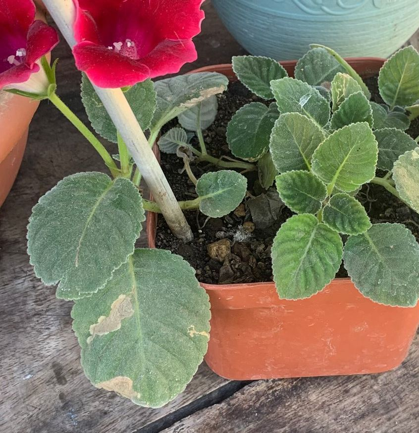

# yapraklara su vermek

## Ne Gözlüyorsunuz
Sulama/sisleme sonrası yapraklarda yuvarlak, keskin kenarlı solgun veya kahverengi lekeler; özellikle güneş alan yüzlerde. Bazı türlerde şeffaf cam kesiği gibi izler.

## Kısa Açıklama
Yaprak üzerinde kalan su damlaları **mercek etkisi** yapabilir veya mantar/bakteri girişini kolaylaştırır; sıcak ışıkla birleşince yerel yanık oluşur.

## Doğal mı, Sorun mu?
Genellikle **bakım hatası** kaynaklı kozmetik bir sorundur; ileri durumlarda ikincil enfeksiyon gelişebilir.

## Olası Nedenler
- Öğlen güneşinde sisleme/duşlama
- Sert suyla sık sprey
- Serin, durağan havada yaprağın uzun süre ıslak kalması

## Nasıl Doğrulanır
- Lekeler genelde **dairesel** ve tek tek; güneş yönünde daha fazladır
- Damar desenini takip etmez; üst yüzeyden başlar
- Sprey alışkanlığıyla zamanlama çakışır

## Ne Yapmalı
1. Sisleme/duşlamayı sabaha alın; yapraklar gün içinde kurusun.
2. Filtre/arıtılmış su kullanın; sert su izlerini silin.
3. Direkt güneşte ıslak yaprak bırakmayın; gerekirse gölgeleyin.
4. Yaygın lekelerde estetik budama yapılabilir; yeni yapraklar sağlıklı çıkacaktır.

## Önleme
- Nem ihtiyacını sprey yerine çevresel yöntemlerle (tepsi, nem cihazı) karşılayın.
- Hastalığa hassas türlerde yaprakları kuru tutun.
- Sulamada hedef kök bölgesi olsun, yapraklar değil.

## Resimler

